# How each pattern works

One section per pattern. Each has a diagram, the mechanism in plain language,
the failure it prevents, and a pointer to the files you copy.

Diagrams render on GitHub as-is. Nothing here is specific to Cloudflare except
where noted — the shapes apply to any Terraform provider.

> **Presenting these?** [docs/DIAGRAM-SCRIPT.md](../docs/DIAGRAM-SCRIPT.md) is a
> read-aloud walkthrough of all thirteen diagrams, with pointing cues and
> timings. Roughly 50 minutes, or 30 if you cut to the spine.

**Contents**

| # | Pattern | Prevents |
|---|---|---|
| 1 | [The gated pipeline](#1-the-gated-pipeline) | applying something nobody approved |
| 2 | [Two-tier testing](#2-two-tier-testing) | tests too slow to run, or too fake to help |
| 3 | [Module contracts](#3-module-contracts) | bad input discovered mid-apply |
| 4 | [Singleton ownership](#4-singleton-ownership) | two pipelines silently reverting each other |
| 5 | [Composition from fragments](#5-composition-from-fragments) | merge conflicts and accidental ordering |
| 6 | [The kill-switch](#6-the-kill-switch) | writing Terraform during an incident |
| 7 | [Drift detection](#7-drift-detection) | code that quietly stops describing production |
| 8 | [Brownfield adoption](#8-brownfield-adoption) | outages while importing a live estate |
| 9 | [Tunnel HA](#9-tunnel-ha-and-rotation) | a single connector as a single point of failure |
| 10 | [The sharp edges](#10-the-sharp-edges) | four specific ways this bites |

**[Part II — the same patterns for AI systems](#part-ii--the-same-patterns-for-ai-systems)**

| # | Pattern | Prevents |
|---|---|---|
| AI-1 | [The gated eval pipeline](#ai-1-the-gated-eval-pipeline) | shipping a prompt nobody measured |
| AI-2 | [Two-tier evaluation](#ai-2-two-tier-evaluation) | evals too slow to run, or too flaky to trust |
| AI-3 | [Model drift detection](#ai-3-model-drift-detection) | quality falling with zero code changes |
| AI-4 | [Brownfield prompt adoption](#ai-4-brownfield-prompt-adoption) | refactoring prompts nobody measured |
| AI-5 | [The sharp edges, AI edition](#ai-5-the-sharp-edges-ai-edition) | injection, contamination, silent deprecation |

---

## The whole system, one picture

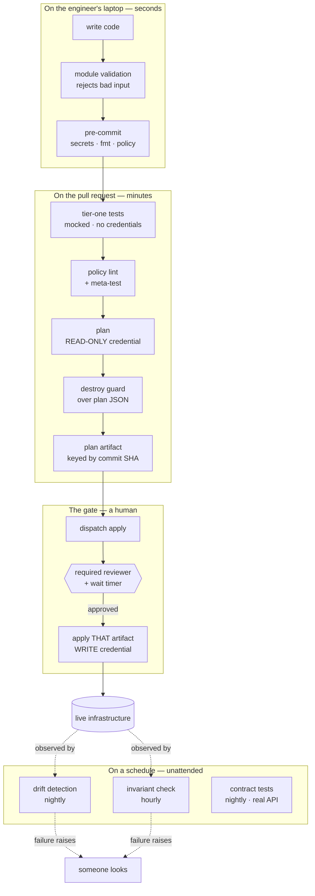

**The organising idea:** every check sits at the cheapest layer that can
possibly catch its class of mistake. A validation block costs a second and
involves one person. A production incident costs a night and involves
everyone. The gap between those two numbers is the entire argument.

---

## 1. The gated pipeline

**Files:** [`workflows/terraform-pr.yml`](workflows/terraform-pr.yml) ·
[`workflows/terraform-apply.yml`](workflows/terraform-apply.yml)

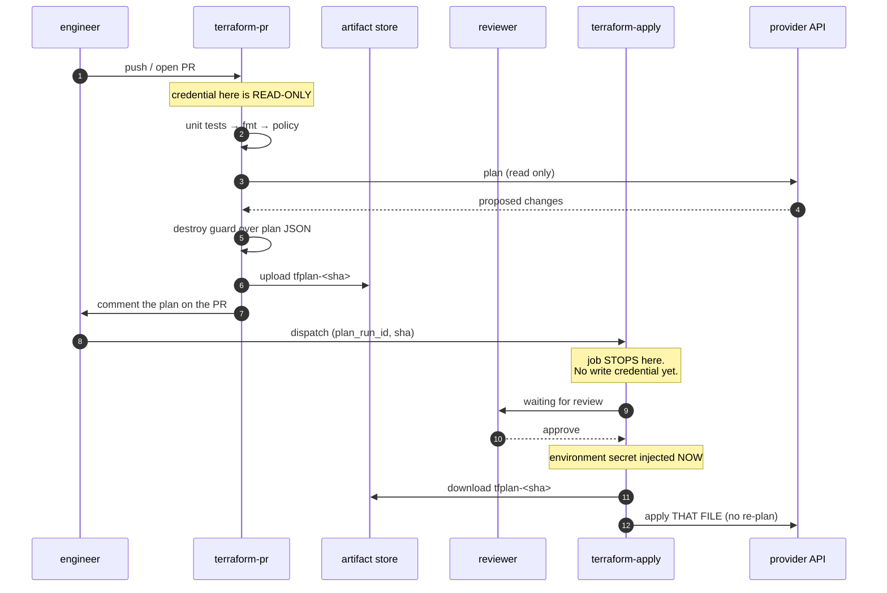

### The mechanism

Two separate ideas, and it is worth keeping them separate in your head:

**The credential is unreachable.** The write token is an *environment* secret,
not a repo secret. GitHub does not inject it until the environment's protection
rules pass. So unreviewed code cannot reach the credential — not because a
policy forbids it, but because it is not there.

**The plan is pinned.** The PR uploads `tfplan-<sha>` and the apply job runs
`terraform apply <planfile>`. There is deliberately **no `plan` command in the
apply workflow at all**. If you add one "just to be safe", you have deleted the
guarantee.

### What it prevents

Reviewer approves plan A; the world moves; the pipeline computes plan B and
applies that. Nobody lied — the process just had a hole. And you get a bonus
invariant for free: if state changed after the plan was made, Terraform itself
refuses.

```
Error: Saved plan is stale
```

That is the tool enforcing it. Process can be skipped; this cannot.

### Adopting it

1. Create two environments: `plan` (read-only token, no rules) and `apply`
   (write token, required reviewers, 1-minute wait timer).
2. Copy both workflow files, change the `# >>> CHANGE` lines.
3. Resist the urge to auto-dispatch the apply. The manual step is the product.

> **The wait timer is not theatre.** One minute is the window in which somebody
> says "wait, that's the wrong environment". Set it to something you'd actually
> use.

---

## 2. Two-tier testing

**Files:** [`workflows/terraform-pr.yml`](workflows/terraform-pr.yml) (tier one) ·
[`workflows/contract-tests.yml`](workflows/contract-tests.yml) (tier two) ·
[`examples/unit.tftest.hcl`](examples/unit.tftest.hcl)

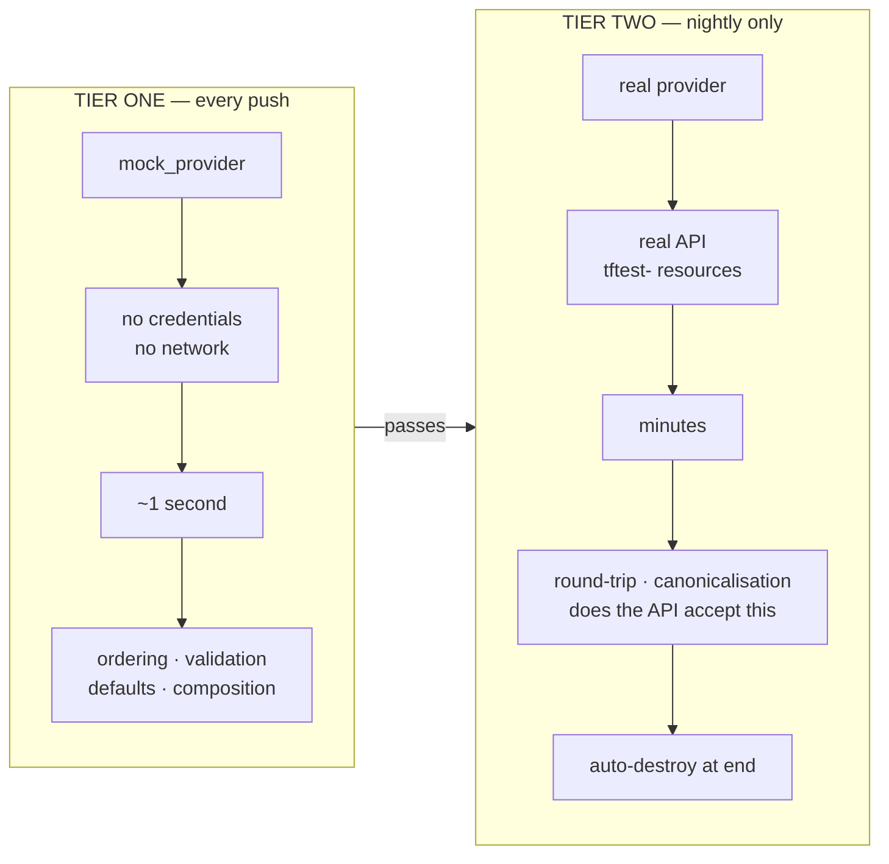

### The mechanism

Most infrastructure teams have no unit tests because "testing infrastructure
means creating infrastructure". `mock_provider` breaks that assumption — the
provider is stubbed, so the test exercises *your logic* with no API and no
credential.

That makes tier one fast enough to run on every push, which is what makes it
survive. A test suite that takes ten minutes gets skipped within a month.

Tier two exists because mocks cannot tell you what the API actually does with
your input — whether it canonicalises a value, rejects a combination, or
rewrites what you sent. Those are real and they only show up against the real
thing. So tier two runs nightly, against real resources, with a reserved
prefix, and destroys them when it finishes.

### Two traps worth knowing before you start

**Declare variables inside the test file.** A `.tftest.hcl` that references
`var.foo` without declaring it makes Terraform parse `TF_VAR_foo` as an HCL
*expression*. A value like `my-zone.example.com` then dies with
`Extra characters after expression`, which tells you nothing.

**`terraform init` needs `-test-directory` too.** A plain init does not install
modules referenced from a non-default test directory, and the suite fails at
run time with `Module not installed`.

### What it prevents

Tests that are too slow to run, or too fake to be worth running.

---

## 3. Module contracts

**Files:** [`modules/README.md`](modules/README.md) ·
[`examples/variables-with-validation.tf`](examples/variables-with-validation.tf)

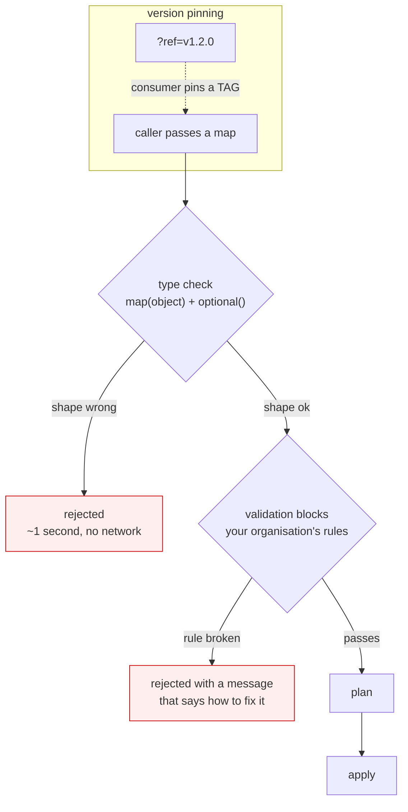

### The mechanism

A module is an API. If the only way to discover you passed the wrong thing is a
500 from the provider three minutes into an apply, it is a bad API.

Two things make it a real contract:

**A typed interface.** One `map(object)` with `optional()` defaults, so callers
pass what they mean rather than eleven positional nulls, and adding a field
later does not break every existing caller.

**Validation blocks that carry your rules,** not just the provider's. The type
system knows what Terraform allows. Only you know what *your organisation*
allows. Write the message so it names the allowed set and says why:

```
Every DNS record key must start with 'lab-'. This module refuses to create
records that are not trivially identifiable as lab-owned.
```

A validation that only says "invalid input" teaches nobody anything. Writing
the sentence is the work.

**And pin by tag.** `?ref=v1.2.0` means your environment cannot change because
somebody pushed to main. Upgrading becomes a commit you make deliberately,
visible in a diff, revertible.

### What it prevents

Bad input discovered mid-apply, and environments that drift because a shared
module moved under them.

---

## 4. Singleton ownership

**Files:** [`examples/singleton-ownership.tf`](examples/singleton-ownership.tf)

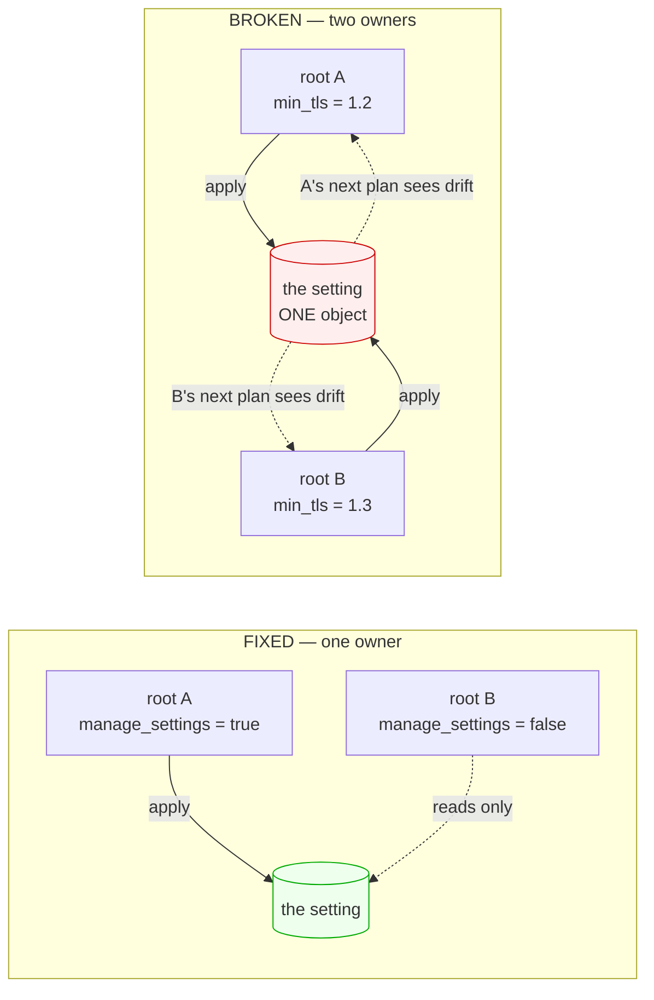

### The mechanism

Some things are singletons. There is exactly one "minimum TLS version" for a
zone. Not one per team — one. When two Terraform roots both declare it, **both
applies succeed**. Each silently reverts the other. Both pipelines stay green
forever.

Nothing errors, so nothing tells you. That is what makes this class of bug
expensive: it runs for months and surfaces during an incident.

The fix is not clever, it is a boolean. Exactly one root passes
`manage_settings = true`. Everyone else consumes the module for the non-singleton
parts. The contract lives in the type system rather than in a wiki page.

### Why `ignore_changes` is the wrong fix

It stops managing the field *entirely*. You would trade a cosmetic annoyance
for blindness to a real unauthorised change on the same field.

### What it prevents

Two pipelines quietly fighting, both reporting success.

---

## 5. Composition from fragments

**Files:** [`policy/fragment_policy.rego`](policy/fragment_policy.rego) ·
[`examples/composed-ruleset.tf`](examples/composed-ruleset.tf)

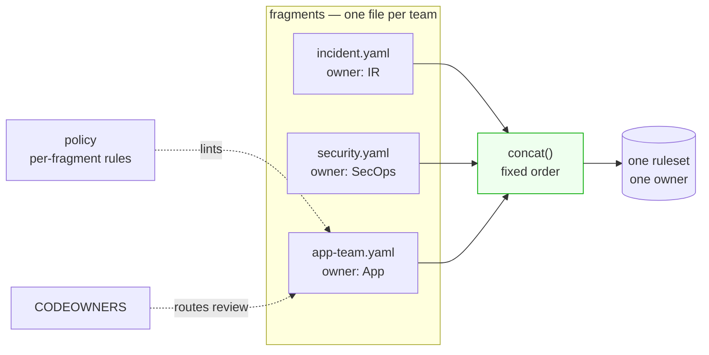

### The mechanism

Several teams need rules in one object. They must not edit each other's rules,
order matters enormously, and every rule needs an owner you can find at 3am.

**One file per team** kills the merge conflicts. **A `concat()` in a fixed
order** makes precedence structural rather than conventional — incident rules
are first because the code says so, not because three teams remembered.
**CODEOWNERS** routes each fragment's review to its team. **Per-fragment
policy** enforces what each team may do:

> `app-team fragment: rule 'loadtest_skip' uses action 'skip'. Skip bypasses
> the incident and security rules that run above it.`

That message matters. The app team asked for a narrow exception and reached for
a mechanism far wider than they realised — a `skip` in the last fragment skips
*everything above it*, including the incident rules. Nobody was careless. That
is the normal case.

**Stamp owner and review date into the rendered description.** At 3am you read
the rule in the console and it tells you who owns it and when it was last
looked at.

### The meta-test — do not skip this

Run your policy against a file you know is bad and fail the build if it
*passes*. A lint that has quietly stopped linting is worse than no lint,
because you trust it. See the `known-bad fixture must FAIL policy` step.

### What it prevents

Merge conflicts on a shared object, and precedence that depends on people
remembering.

---

## 6. The kill-switch

**Files:** [`workflows/invariant-check.yml`](workflows/invariant-check.yml)

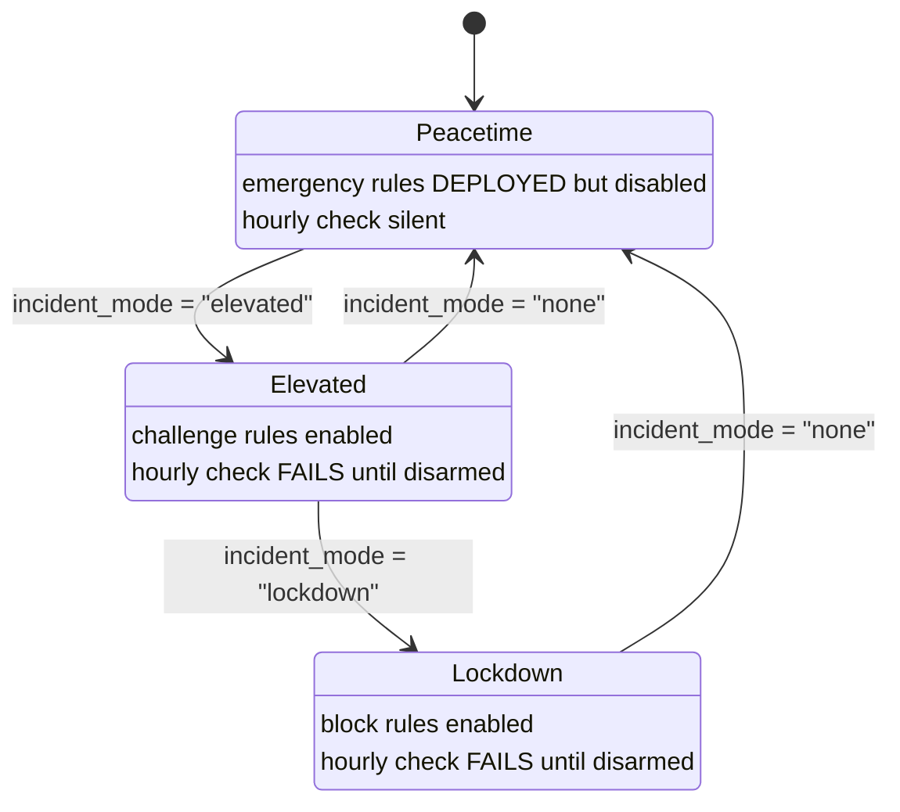

### The mechanism

During an incident you want to raise defences in seconds, not write new
Terraform under pressure at 3am. So the emergency rules are **already written,
already reviewed, already deployed — and disabled.** Arming is a one-variable
change: `incident_mode` flips `enabled` across every emergency rule at once.

The second half is the part people skip. Every team is good at arming. Nobody
is good at disarming. So an hourly job asks the **API** what is enabled — not
your tfvars, because tfvars describe intent and intent is exactly what is wrong
when someone armed something by hand.

If anything is still armed, the job **fails**. A failing scheduled workflow
emails the owner and shows red on the Actions tab, every hour, until somebody
disarms. The nagging is the feature.

**Success is silent.** You only hear from it when it matters.

### Generalising it

The shape covers far more than WAF rules: a maintenance page still being
served, a feature flag left forced, a firewall rule opened "just for the
migration", debug logging left at TRACE.

### What it prevents

Emergency measures that quietly become permanent.

---

## 7. Drift detection

**Files:** [`workflows/drift-detection.yml`](workflows/drift-detection.yml) ·
[`scripts/drift_report.py`](scripts/drift_report.py)


### The mechanism

`plan -detailed-exitcode` returns three distinct codes, and the third is the
one nobody uses: **0 clean, 1 error, 2 the world moved.** Exit 2 is the entire
trick, and it is what you put on a cron.

Why a schedule and not a PR check: drift does not happen when you push. It
happens at 2am during an outage, when someone with console access fixes
something by hand. A check that only runs when code changes will never see it.

Read `resource_drift` in the plan JSON, not `resource_changes` —
`resource_drift` is specifically what changed *outside* Terraform.

**Read-only on purpose.** Noticing that something is wrong should never require
the ability to change it.

**Fail, don't warn.** A drift job that goes green-with-a-warning is ignored
within two weeks.

### Attribution

Join the drift to your provider's audit log and name the actor. Make this step
`continue-on-error: true` — attribution failing must never suppress detection.
In our lab the audit lookup needs a permission the token lacks, so detection
works and naming does not; the report says so in one line rather than pretending.

### What it prevents

Code that quietly stops describing production, discovered during the next
incident.

---

## 8. Brownfield adoption

**Files:** [`scripts/normalize.py`](scripts/normalize.py) ·
[`examples/import-blocks.tf`](examples/import-blocks.tf)

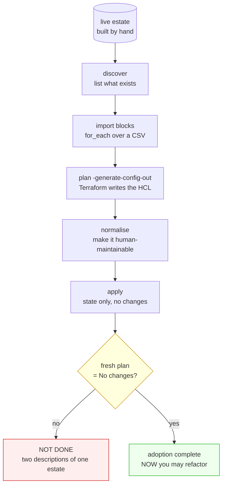

### The mechanism

Nobody starts greenfield. You inherit an estate someone built by hand and have
to bring it under Terraform without an outage, because these are live records.

**`import` blocks, not the `terraform import` command.** Import blocks are
declarative: they live in code, appear in the diff, get reviewed, and can be
`for_each`'d over a list. The old CLI command was a one-shot you ran by hand and
hoped.

**`-generate-config-out`** makes Terraform write the HCL for you. It is correct
and unreadable — machine-named resources, every attribute spelled out. Normalise
it into something a human will maintain, or nobody will.

**The gate is the step people skip.** Adoption is not finished when it applies.
It is finished when a *fresh plan says no changes*. Until then you have two
descriptions of one estate and no idea which is true. Make it a hard gate:

```bash
terraform plan -detailed-exitcode || { echo "NOT clean — do not refactor yet"; exit 1; }
```

### What it prevents

Half-adopted estates, and the refactor-on-top-of-uncertainty that follows.

---

## 9. Tunnel HA and rotation

**Files:** [`examples/tunnel-ha.tf`](examples/tunnel-ha.tf) ·
[`examples/docker-compose.tunnel.yml`](examples/docker-compose.tunnel.yml)

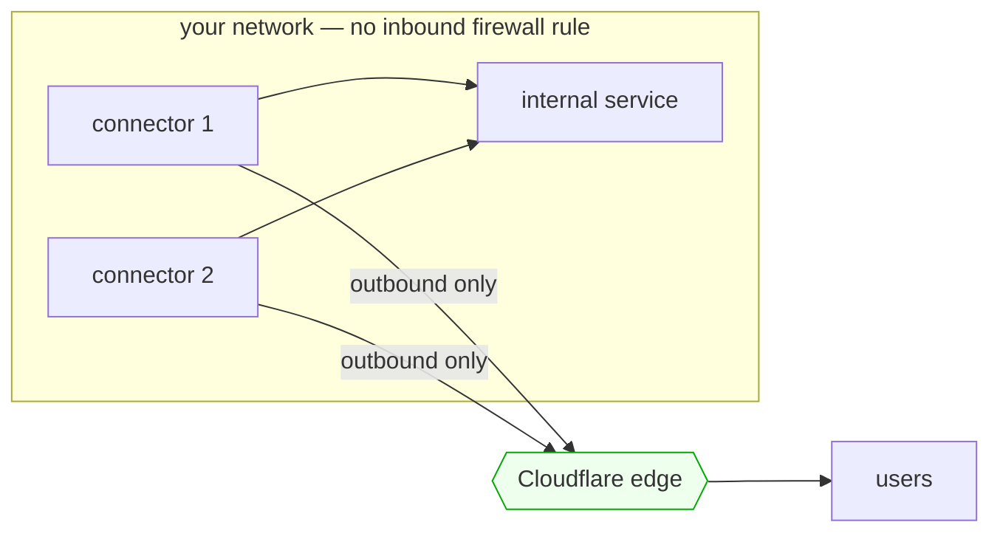

**Rotation without downtime:**

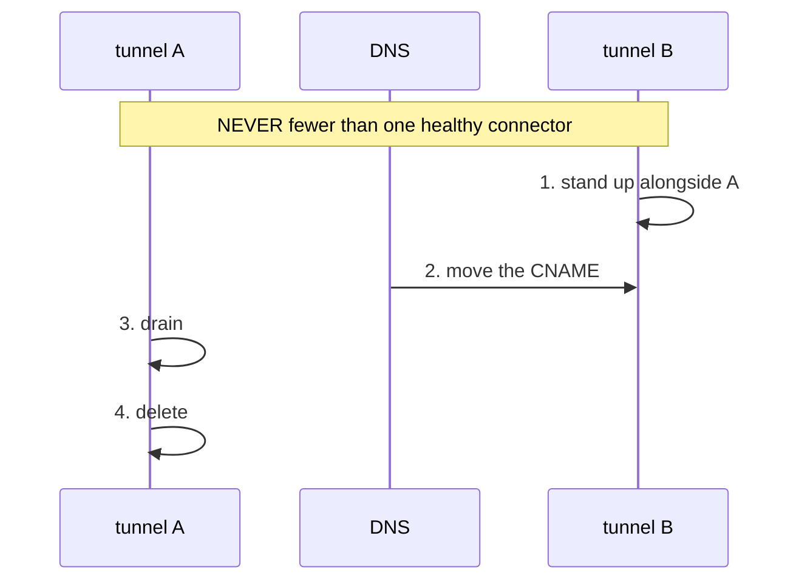

### The mechanism

A tunnel is an outbound-only connection from your network to the edge, so you
publish an internal service with no inbound firewall rule and no public IP.

**One tunnel, several connectors.** Run at least two replicas; the edge
load-balances across healthy ones. Kill one and traffic keeps flowing.

**Manage config remotely** (`config_src = "cloudflare"`) so a replica restart
cannot pick up a stale local file.

**The catch-all ingress rule must be last** — omit it and the tunnel refuses to
start. It is the `default:` of a switch statement.

**Rotate in two steps, never one.** Delete-then-create has a window with zero
healthy connectors. Stand the new one up first, move DNS, drain, then delete.

> **Unverified in our lab:** the token could read tunnels but not create them,
> so this pattern is documented from the module rather than demonstrated end to
> end. Test it in your own account before relying on it.

### What it prevents

A single connector as a single point of failure, and rotations that take the
service down.

---

## 10. The sharp edges

Four specific failures, each cheap to avoid once you have seen it.

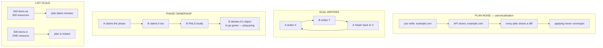

### Plan noise — the API rewrites what you asked for

You write a CNAME without a trailing dot; the API stores it with one. Now every
plan shows a diff, applying does not converge, and the pipeline is never green
again.

**Fix:** write the canonical form — what the API will actually store.

**Do NOT reach for `ignore_changes`.** It silences the diff by no longer
managing the field at all, so a genuine repoint of that CNAME also passes
unnoticed. You would trade a cosmetic itch for blindness on the field that
matters most.

### Dual writers — the silent one

Two roots manage the same record. B overwrites A; A's next run "heals" it back;
repeat forever, both pipelines green. Same root cause as singleton ownership,
different object. Detection is drift + audit log.

### Phase ownership — the loud one, which is better

Two roots claim the same ruleset phase. The second **fails loudly** — the slot
is taken and the API says so. That is the healthy outcome.

The pathological path is what happens next: B's team deletes A's object in the
console so their pipeline goes green, and A's next apply recreates it. Now you
have ping-pong plus a deletion nobody reviewed.

**Fix:** one root owns a phase; other teams contribute *fragments* to it
(pattern 5), never their own object.

### List scale — model the collection, not the items

500 entries as 500 resources means 500 API reads per plan. The same 500 as
*items inside one resource* is a single read. Model the collection as the unit
when the provider offers both.

> **Measured, not demonstrated:** our lab token lacked account-level list
> permissions. Benchmark this in your own account before designing around it.

---

## Adopting these — a suggested order

You do not need all ten, and doing them in the wrong order wastes effort.

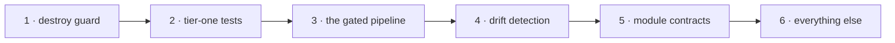

1. **Destroy guard first.** Highest value per line in the whole kit, and it
   works against any plan you already produce.
2. **Tier-one tests.** They make everything after this safe to change.
3. **The gated pipeline.** The big one. Do it once tests exist.
4. **Drift detection.** Now that code is trustworthy, find out where reality
   disagrees.
5. **Module contracts.** Refactor toward these as modules stabilise.
6. The rest as the problems actually show up. Adopting a pattern for a problem
   you do not have is how platform teams lose credibility.

---
---

# Part II — the same patterns for AI systems

Everything above is about infrastructure. This part maps the same five
load-bearing patterns onto LLM systems: prompts, models, retrieval, tools,
agents.

The mapping is not a metaphor. A prompt is configuration. A model version is a
pinned dependency. An eval suite is a test suite. And an LLM system has one
property infrastructure does not — **it can change behaviour with no diff at
all**, because the model underneath you moved. That makes drift detection more
important here, not less.

| Infra pattern | AI equivalent | The thing that bites |
|---|---|---|
| [gated pipeline](#ai-1-the-gated-eval-pipeline) | approve an **eval report**, ship that exact bundle | shipping a prompt nobody measured |
| [two-tier testing](#ai-2-two-tier-evaluation) | offline assertions vs live-model evals | evals too slow and costly to run, or too fake to help |
| [drift detection](#ai-3-model-drift-detection) | re-run a frozen eval set against a pinned model | quality falling with zero code changes |
| [brownfield adoption](#ai-4-brownfield-prompt-adoption) | inventory scattered prompts, freeze a baseline | refactoring prompts nobody measured |
| [sharp edges](#ai-5-the-sharp-edges-ai-edition) | five specific AI failures | non-determinism, injection, silent deprecation |

> **Status: design guidance, not verified.** Part I was built and run against a
> live account. This part was not — there was no AI system in the lab to run it
> against. The shapes come from the same reasoning and from well-documented
> failure modes, but treat every threshold and number here as a starting point
> to calibrate, not a measurement. It is labelled this way on purpose; see the
> verified/not-verified section in [README.md](README.md).

---

## The AI system, one picture

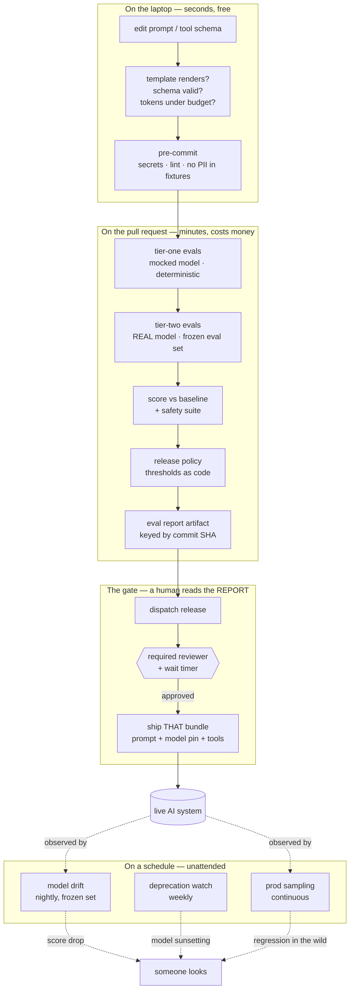

**What changes versus Part I.** Two things, and both are load-bearing.

**The plan becomes an eval report.** In Terraform the artifact is a plan: a
precise list of what will change. In an AI system there is no such list —
behaviour is statistical. So the artifact is a *measurement*: scores on a frozen
eval set, with confidence intervals, against a named baseline.

**The dependency can move without you.** A Terraform provider version stays put
until you bump it. A model endpoint can be updated underneath you. That is the
difference between an alias and a dated snapshot, and it is why the nightly
drift job matters more here than it does for infrastructure.

---

## AI-1. The gated eval pipeline

**Files:** [`workflows/ai-eval-pr.yml`](workflows/ai-eval-pr.yml) ·
[`workflows/ai-release.yml`](workflows/ai-release.yml) ·
[`policy/eval_release_guard.rego`](policy/eval_release_guard.rego)

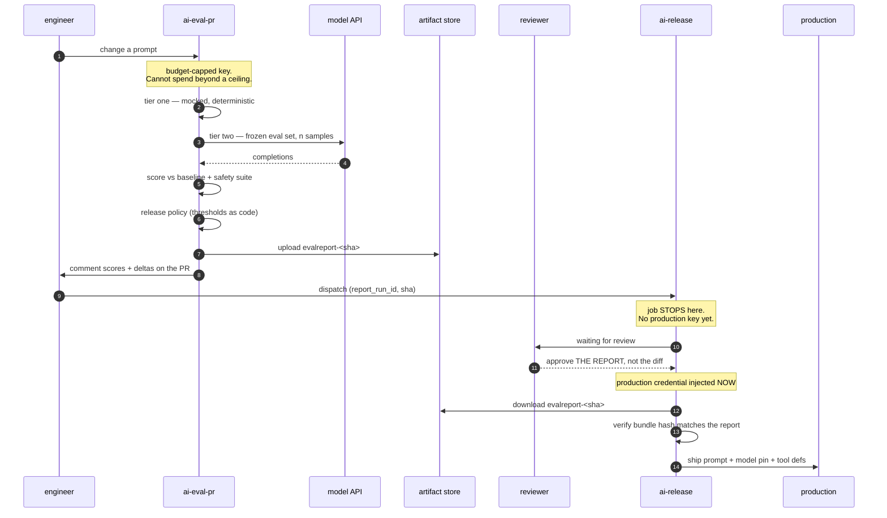

### The mechanism

Same two ideas as Part I, adapted.

**The credential is unreachable, and it is also a budget.** An AI pipeline has a
failure mode infrastructure does not: a runaway loop that spends real money. So
the PR environment holds a key with a hard spending cap, and the production key
lives behind the gate. Two different risks, two different credentials.

**The bundle is pinned, and it is bigger than a prompt.** What ships is not "the
prompt". It is:

```
prompt template + model snapshot id + decoding params + tool definitions
+ retrieval config + system instructions
```

Change any one of those and the behaviour changes. So the release artifact is a
**hash of the whole bundle**, and the release job verifies that the hash it is
about to ship matches the hash that was evaluated. If someone edits the prompt
between the eval and the release, the hashes diverge and the job refuses.

That is this pattern's version of `Error: Saved plan is stale`.

### What the reviewer actually approves

This is worth being explicit about. In Terraform the reviewer reads a diff and a
plan. Here, **the diff is nearly useless** — a three-word prompt change can move
a score ten points, and a rewritten paragraph can move nothing at all.

So the PR comment leads with the measurement, not the diff:

```
evalreport-a1b2c3d  ·  model: <pinned-snapshot-id>  ·  n=200

  accuracy      0.913  →  0.927   +1.4pp   ok
  refusal rate  0.021  →  0.019   -0.2pp   ok
  p95 latency   1.84s  →  2.31s   +0.47s   OVER BUDGET
  cost / 1k     $0.41  →  $0.58   +41%     OVER BUDGET

  safety suite  148/148 pass
  BLOCKED by release policy: latency and cost regressions
```

> **Reviewers approve a measurement, not an intention.** If your PR comment
> shows a diff and not a score, you have built code review, not an eval gate.

### What it prevents

Shipping a prompt change because it "reads better". Also: shipping a bundle that
differs from the one that was measured — easier to do than it sounds once
prompts live in several files.

### Adopting it

1. Freeze an eval set **before** you change anything. Without a baseline there
   is nothing to gate on.
2. Two credentials: budget-capped for PRs, production behind the gate.
3. Thresholds in [`policy/eval_release_guard.rego`](policy/eval_release_guard.rego),
   not in a runbook. Start with the ones you can defend and add more as you
   learn what actually regresses.

---

## AI-2. Two-tier evaluation

**Files:** [`workflows/ai-eval-pr.yml`](workflows/ai-eval-pr.yml) ·
[`examples/eval-tier-one.py`](examples/eval-tier-one.py) ·
[`examples/evalset.yaml`](examples/evalset.yaml)

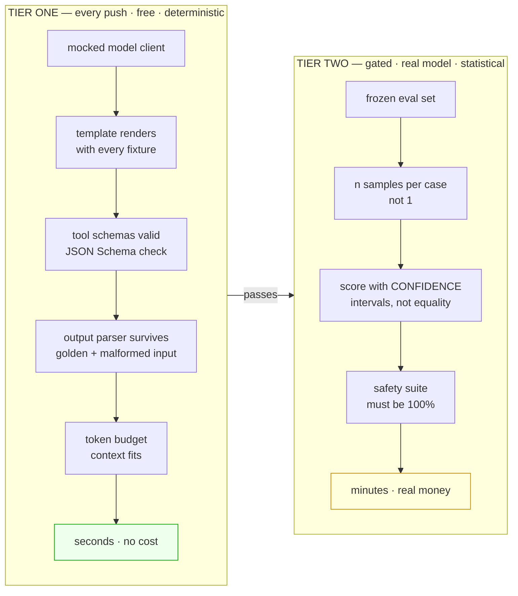

### The mechanism

The split is the same as Part I and for the same reason: an eval suite that
costs twenty dollars and eight minutes will not run on every push, and one that
does not run on every push does not protect you.

**Tier one never calls a model.** It is not a weaker version of tier two — it
catches an entirely different and surprisingly large class of bug:

- a template that crashes when a variable is empty or contains a brace
- a tool definition that is not valid JSON Schema, so the model never calls it
- an output parser that dies on the model's second-most-common format
- a prompt that silently exceeds the context window once retrieval is included

None of those need a model to find, and all of them are outages.

**Tier two is statistical, and this is where teams get it wrong.** An LLM eval
is not a unit test. Three rules:

**Sample more than once.** Even at temperature 0, output is not guaranteed
identical across calls. Run each case *n* times — n=5 for a quick signal, n=20+
when you need a tight interval.

**Assert on intervals, not equality.** `accuracy == 0.93` is a flaky test.
`accuracy >= baseline - 2pp` at a stated confidence level is a check. If your
eval fails randomly one run in five, people will rerun it until it goes green,
and you have lost the signal entirely.

**Separate the safety suite.** Quality metrics get a tolerance band. Safety
cases do not — those are pass/fail at 100%, and a regression there blocks
regardless of how good the quality numbers look.

### On LLM-as-judge

Useful, and a dependency like any other. Two rules if you use one: **pin the
judge model separately** from the model under test, and **hold out a
human-labelled subset** to check the judge itself has not drifted. A judge whose
behaviour moved will report clean scores while quality falls — which is the
worst possible failure, because it is silent and it is in your instrumentation.

### What it prevents

Evals too slow and expensive to run, and evals so flaky people learn to rerun
them until green.

---

## AI-3. Model drift detection

**Files:** [`workflows/ai-drift.yml`](workflows/ai-drift.yml)

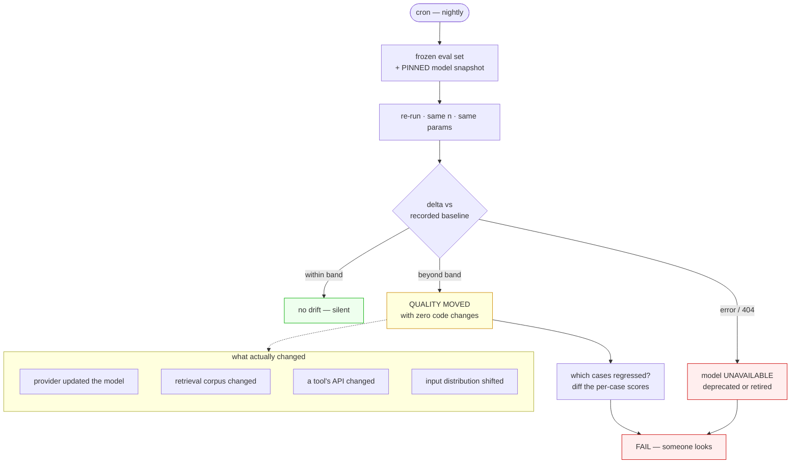

### The mechanism

This is the pattern that matters most in the AI half, because of a property
infrastructure does not have: **your system can get worse while nobody touches
it.**

Four ways that happens, none of which produce a commit:

1. **The provider updated the model.** An undated alias points at whatever is
   current. Pin the dated snapshot and you control when you move.
2. **Your retrieval corpus changed.** Same prompt, same model, different
   documents retrieved, different answer.
3. **A tool the agent calls changed** its response shape or its latency.
4. **Your input distribution shifted.** The model did not change; what users
   send it did.

So: freeze an eval set, pin the model, re-run nightly, compare to a recorded
baseline. Anything beyond the band is drift.

**Pin the model AND watch for deprecation.** These are different checks. A
pinned snapshot protects you from silent updates — and then gets retired on a
published schedule. A weekly job that calls each pinned model once and fails on
a 404 or a deprecation header turns "the model disappeared on Tuesday" into
weeks of warning.

### Reading the result honestly

A nightly eval has run-to-run variance, so the threshold has to sit outside the
noise or you will get paged for nothing. **Establish the noise floor first:**
run the same eval against the same pin, unchanged, for a week, and see how much
it moves on its own. Set the band above that.

A drift job that cries wolf is ignored within two weeks — the same failure mode
as Part I, arriving faster because here the noise is real rather than imagined.

And when it fires, **diff the per-case scores, not just the aggregate.** An
aggregate that fell two points because one category collapsed is a completely
different problem from one that fell two points evenly across the board.

### What it prevents

Quality degrading silently, and finding out from a customer rather than from a
job.

---

## AI-4. Brownfield prompt adoption

**Files:** [`examples/prompt-inventory.md`](examples/prompt-inventory.md)

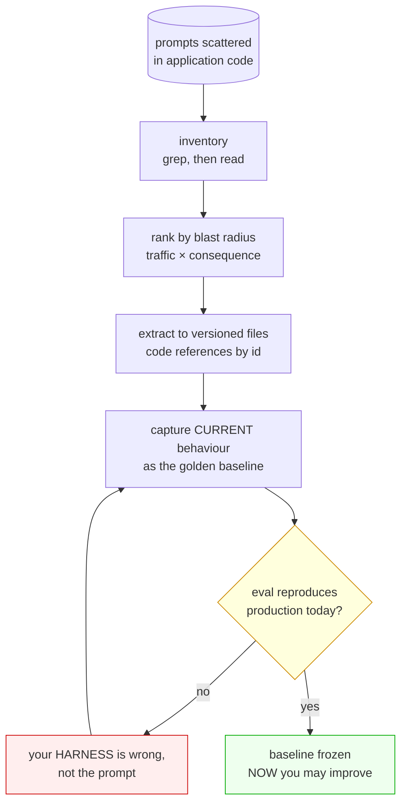

### The mechanism

The inherited AI system looks like this: prompts as f-strings in application
code, a few in a config file, one in a Slack message somebody pasted. No
versioning. No evals. Nobody knows which ones carry traffic.

The instinct is to start improving them. That is the mistake, and it is exactly
the same mistake as refactoring an unadopted Terraform estate.

**Inventory first, and rank by blast radius.** Traffic times consequence. The
prompt behind a support-ticket classifier that runs ten thousand times a day
outranks the one that formats an internal digest, however ugly the second one is.

**Extract, do not improve.** Move each prompt to a versioned file with an id;
application code references the id. Change *nothing* about the text yet. This
step should be behaviour-neutral, and reviewable as such.

**Then the step everyone skips: capture current behaviour as the baseline.**
Sample real production inputs, record what the current system does, and make
that your golden set — **including the outputs you think are wrong.**

> You are not capturing what the system *should* do. You are capturing what it
> *does*, so that when you change it you can prove what moved.

**The gate:** your eval harness, running the extracted prompt, must reproduce
production behaviour on that sample. If it does not, your harness is wrong —
wrong temperature, missing system message, different retrieval config — and
improving the prompt on top of a harness that does not reproduce production
means you cannot attribute any change to anything.

This is the exact analogue of `plan == No changes` before you refactor.

### What it prevents

Improving prompts nobody measured, and being unable to prove afterwards whether
you helped or hurt.

---

## AI-5. The sharp edges, AI edition

```mermaid
flowchart TB
    subgraph s1["NON-DETERMINISM AS FLAKINESS"]
        A1["assert output == expected"] --> A2["fails 1 run in 5"]
        A2 --> A3["team reruns until green"]
        A3 --> A4["signal is gone"]
    end
    subgraph s2["PROMPT INJECTION VIA RETRIEVAL"]
        B1["retrieved doc contains<br/>instruction-shaped text"] --> B2["model treats DATA<br/>as INSTRUCTIONS"]
        B2 --> B3["your own corpus<br/>is the attack surface"]
    end
    subgraph s3["EVAL SET CONTAMINATION"]
        C1["tune against the eval set"] --> C2["scores climb"]
        C2 --> C3["production flat"]
        C3 --> C1
    end
    subgraph s4["SILENT DEPRECATION"]
        D1["pinned to a dated snapshot"] --> D2["retired on schedule"]
        D2 --> D3["404 in production<br/>on a Tuesday"]
    end
    subgraph s5["CONTEXT COST CURVE"]
        E1["just add more context"] --> E2["cost and latency<br/>grow with input"]
        E2 --> E3["accuracy often falls<br/>past a point"]
    end
```

### 1 · Non-determinism treated as flakiness

The Part I analogue is plan noise: a diff that never converges, so people stop
reading diffs. Here it is an eval that fails randomly, so people stop reading
evals.

**Fix:** sample n times, assert on intervals, and set thresholds outside the
measured noise floor. Measure the floor — do not guess it.

**Do not** fix it by pinning temperature to 0 and asserting equality. That is
this pattern's `ignore_changes`: it looks deterministic, it is not quite, and
you have hidden real variance instead of accounting for it.

### 2 · Prompt injection via retrieved content

The closest analogue to the dual-writer problem, and worse. In RAG and agent
systems, retrieved documents and tool results enter the same context as your
instructions. Content shaped like an instruction can be treated as one.

The uncomfortable part: **your own corpus is the attack surface.** A support
ticket, a wiki page, a scraped web result — anything a user can influence that
later gets retrieved.

**Mitigations, none of which is complete on its own:** mark retrieved content
explicitly as untrusted data in the prompt structure; never let retrieved
content decide which tool runs; require confirmation for consequential actions;
and treat every tool result as untrusted input to the next step.

Then test it — put injection strings in your eval set as **safety cases**, so a
regression here blocks a release the same way any other safety failure does.

### 3 · Eval set contamination

You tune against your eval set. Scores climb. Production does not move.

You have overfitted to two hundred examples. The Part I analogue is a lint that
has quietly stopped linting: it still reports green and no longer measures
anything.

**Fix:** hold out a set you never tune against and look at only rarely. Refresh
your eval set from production periodically. And when a score jumps a lot,
suspect contamination before celebrating.

### 4 · Silent deprecation

Pinning a dated model snapshot is correct, and it has a cost: pinned snapshots
get retired. The pin that protects you from silent updates is the same pin that
404s on a sunset date you did not read.

**Fix:** a weekly job that calls every pinned model once and fails on an error
or a deprecation header. Cheap, and it converts a Tuesday outage into weeks of
notice.

### 5 · The context cost curve

The scale analogue. "Just add more context" is the AI version of modelling five
hundred list items as five hundred resources: it works, and then it does not.

Cost and latency scale with input size, and accuracy frequently *falls* past a
point as the relevant detail gets diluted. Measure your own curve — accuracy,
p95 latency and cost against retrieved-chunk count — and pick the knee
deliberately rather than defaulting to "more".

---

## Adopting the AI patterns — suggested order

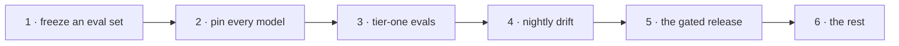

1. **Freeze an eval set.** Nothing else works without a baseline. It does not
   need to be big or clever — fifty real cases beats five hundred synthetic ones.
2. **Pin every model to a dated snapshot,** and add the deprecation watch the
   same day. One-line change, highest ratio of protection to effort in this
   section.
3. **Tier-one evals.** Free, fast, and they catch template and schema breakage
   that would otherwise reach production.
4. **Nightly drift.** Now that a baseline exists, find out when it moves on its
   own.
5. **The gated release.** Do this once you trust your numbers. Gating on a
   measurement you do not believe is theatre.
6. The rest as the problems arrive.

> The ordering differs from Part I on purpose. In infrastructure the first move
> is the destroy guard, because the worst outcome is deleting something. In an
> AI system the worst outcome is **not knowing whether you got better or
> worse** — so the first move is a baseline.
