# How each pattern works

One section per pattern. Each has a diagram, the mechanism in plain language,
the failure it prevents, and a pointer to the files you copy.

Diagrams render on GitHub as-is. Nothing here is specific to Cloudflare except
where noted — the shapes apply to any Terraform provider.

**Contents**

| # | Pattern | Prevents |
|---|---|---|
| 1 | [The gated pipeline](#1-the-gated-pipeline) | applying something nobody approved |
| 2 | [Two-tier testing](#2-two-tier-testing) | tests too slow to run, or too fake to help |
| 3 | [Module contracts](#3-module-contracts) | bad input discovered mid-apply |
| 4 | [Singleton ownership](#4-singleton-ownership) | two pipelines silently reverting each other |
| 5 | [Composition from fragments](#5-composition-from-fragments) | merge conflicts and accidental ordering |
| 6 | [The kill-switch](#6-the-kill-switch) | writing Terraform during an incident |
| 7 | [Drift detection](#7-drift-detection) | code that quietly stops describing production |
| 8 | [Brownfield adoption](#8-brownfield-adoption) | outages while importing a live estate |
| 9 | [Tunnel HA](#9-tunnel-ha-and-rotation) | a single connector as a single point of failure |
| 10 | [The sharp edges](#10-the-sharp-edges) | four specific ways this bites |

---

## The whole system, one picture

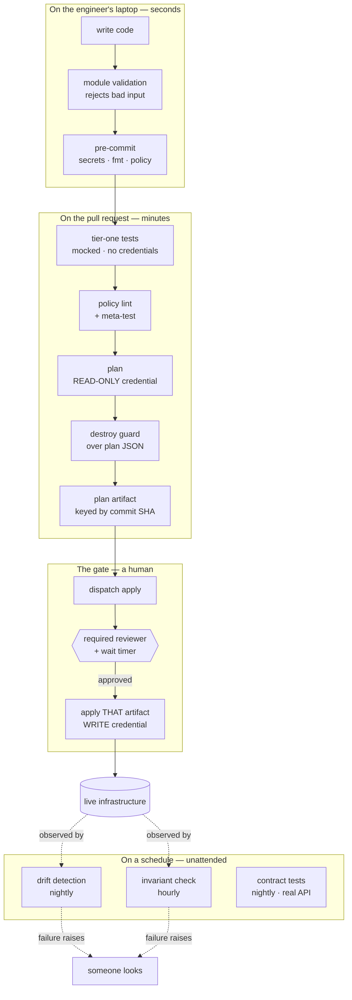

**The organising idea:** every check sits at the cheapest layer that can
possibly catch its class of mistake. A validation block costs a second and
involves one person. A production incident costs a night and involves
everyone. The gap between those two numbers is the entire argument.

---

## 1. The gated pipeline

**Files:** [`workflows/terraform-pr.yml`](workflows/terraform-pr.yml) ·
[`workflows/terraform-apply.yml`](workflows/terraform-apply.yml)

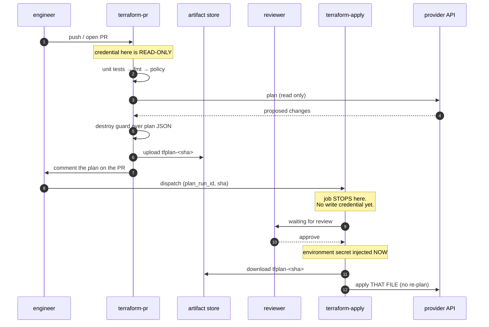

### The mechanism

Two separate ideas, and it is worth keeping them separate in your head:

**The credential is unreachable.** The write token is an *environment* secret,
not a repo secret. GitHub does not inject it until the environment's protection
rules pass. So unreviewed code cannot reach the credential — not because a
policy forbids it, but because it is not there.

**The plan is pinned.** The PR uploads `tfplan-<sha>` and the apply job runs
`terraform apply <planfile>`. There is deliberately **no `plan` command in the
apply workflow at all**. If you add one "just to be safe", you have deleted the
guarantee.

### What it prevents

Reviewer approves plan A; the world moves; the pipeline computes plan B and
applies that. Nobody lied — the process just had a hole. And you get a bonus
invariant for free: if state changed after the plan was made, Terraform itself
refuses.

```
Error: Saved plan is stale
```

That is the tool enforcing it. Process can be skipped; this cannot.

### Adopting it

1. Create two environments: `plan` (read-only token, no rules) and `apply`
   (write token, required reviewers, 1-minute wait timer).
2. Copy both workflow files, change the `# >>> CHANGE` lines.
3. Resist the urge to auto-dispatch the apply. The manual step is the product.

> **The wait timer is not theatre.** One minute is the window in which somebody
> says "wait, that's the wrong environment". Set it to something you'd actually
> use.

---

## 2. Two-tier testing

**Files:** [`workflows/terraform-pr.yml`](workflows/terraform-pr.yml) (tier one) ·
[`workflows/contract-tests.yml`](workflows/contract-tests.yml) (tier two) ·
[`examples/unit.tftest.hcl`](examples/unit.tftest.hcl)

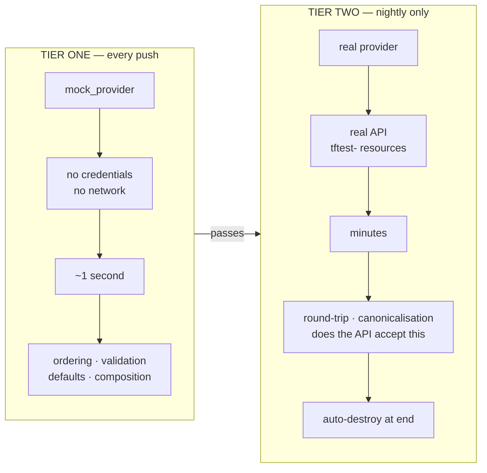

### The mechanism

Most infrastructure teams have no unit tests because "testing infrastructure
means creating infrastructure". `mock_provider` breaks that assumption — the
provider is stubbed, so the test exercises *your logic* with no API and no
credential.

That makes tier one fast enough to run on every push, which is what makes it
survive. A test suite that takes ten minutes gets skipped within a month.

Tier two exists because mocks cannot tell you what the API actually does with
your input — whether it canonicalises a value, rejects a combination, or
rewrites what you sent. Those are real and they only show up against the real
thing. So tier two runs nightly, against real resources, with a reserved
prefix, and destroys them when it finishes.

### Two traps worth knowing before you start

**Declare variables inside the test file.** A `.tftest.hcl` that references
`var.foo` without declaring it makes Terraform parse `TF_VAR_foo` as an HCL
*expression*. A value like `my-zone.example.com` then dies with
`Extra characters after expression`, which tells you nothing.

**`terraform init` needs `-test-directory` too.** A plain init does not install
modules referenced from a non-default test directory, and the suite fails at
run time with `Module not installed`.

### What it prevents

Tests that are too slow to run, or too fake to be worth running.

---

## 3. Module contracts

**Files:** [`modules/README.md`](modules/README.md) ·
[`examples/variables-with-validation.tf`](examples/variables-with-validation.tf)

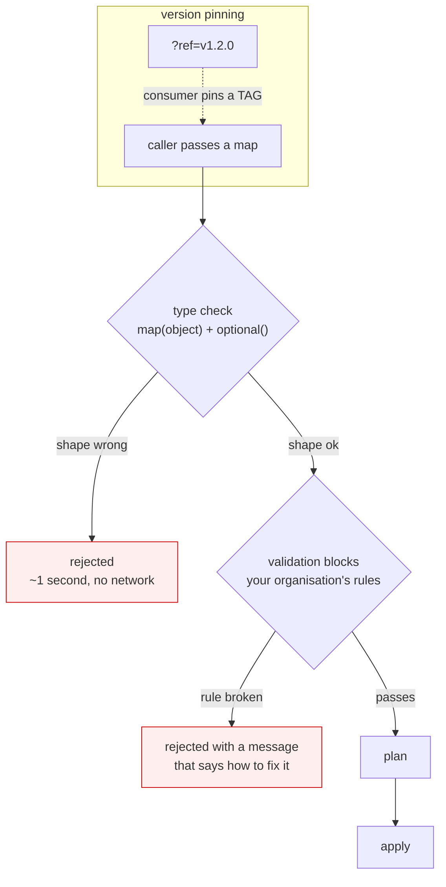

### The mechanism

A module is an API. If the only way to discover you passed the wrong thing is a
500 from the provider three minutes into an apply, it is a bad API.

Two things make it a real contract:

**A typed interface.** One `map(object)` with `optional()` defaults, so callers
pass what they mean rather than eleven positional nulls, and adding a field
later does not break every existing caller.

**Validation blocks that carry your rules,** not just the provider's. The type
system knows what Terraform allows. Only you know what *your organisation*
allows. Write the message so it names the allowed set and says why:

```
Every DNS record key must start with 'lab-'. This module refuses to create
records that are not trivially identifiable as lab-owned.
```

A validation that only says "invalid input" teaches nobody anything. Writing
the sentence is the work.

**And pin by tag.** `?ref=v1.2.0` means your environment cannot change because
somebody pushed to main. Upgrading becomes a commit you make deliberately,
visible in a diff, revertible.

### What it prevents

Bad input discovered mid-apply, and environments that drift because a shared
module moved under them.

---

## 4. Singleton ownership

**Files:** [`examples/singleton-ownership.tf`](examples/singleton-ownership.tf)

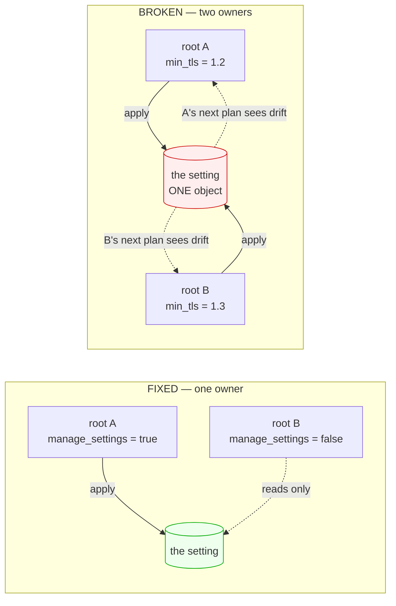

### The mechanism

Some things are singletons. There is exactly one "minimum TLS version" for a
zone. Not one per team — one. When two Terraform roots both declare it, **both
applies succeed**. Each silently reverts the other. Both pipelines stay green
forever.

Nothing errors, so nothing tells you. That is what makes this class of bug
expensive: it runs for months and surfaces during an incident.

The fix is not clever, it is a boolean. Exactly one root passes
`manage_settings = true`. Everyone else consumes the module for the non-singleton
parts. The contract lives in the type system rather than in a wiki page.

### Why `ignore_changes` is the wrong fix

It stops managing the field *entirely*. You would trade a cosmetic annoyance
for blindness to a real unauthorised change on the same field.

### What it prevents

Two pipelines quietly fighting, both reporting success.

---

## 5. Composition from fragments

**Files:** [`policy/fragment_policy.rego`](policy/fragment_policy.rego) ·
[`examples/composed-ruleset.tf`](examples/composed-ruleset.tf)

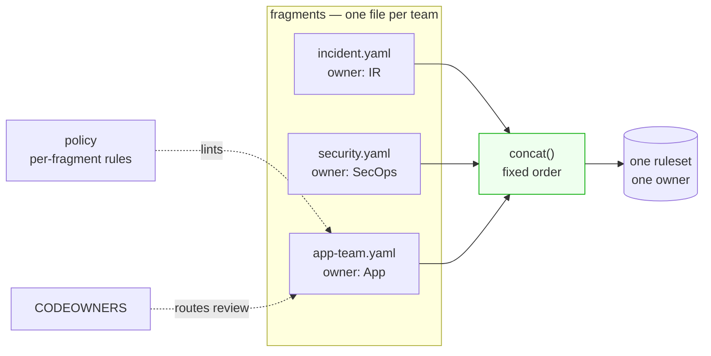

### The mechanism

Several teams need rules in one object. They must not edit each other's rules,
order matters enormously, and every rule needs an owner you can find at 3am.

**One file per team** kills the merge conflicts. **A `concat()` in a fixed
order** makes precedence structural rather than conventional — incident rules
are first because the code says so, not because three teams remembered.
**CODEOWNERS** routes each fragment's review to its team. **Per-fragment
policy** enforces what each team may do:

> `app-team fragment: rule 'loadtest_skip' uses action 'skip'. Skip bypasses
> the incident and security rules that run above it.`

That message matters. The app team asked for a narrow exception and reached for
a mechanism far wider than they realised — a `skip` in the last fragment skips
*everything above it*, including the incident rules. Nobody was careless. That
is the normal case.

**Stamp owner and review date into the rendered description.** At 3am you read
the rule in the console and it tells you who owns it and when it was last
looked at.

### The meta-test — do not skip this

Run your policy against a file you know is bad and fail the build if it
*passes*. A lint that has quietly stopped linting is worse than no lint,
because you trust it. See the `known-bad fixture must FAIL policy` step.

### What it prevents

Merge conflicts on a shared object, and precedence that depends on people
remembering.

---

## 6. The kill-switch

**Files:** [`workflows/invariant-check.yml`](workflows/invariant-check.yml)

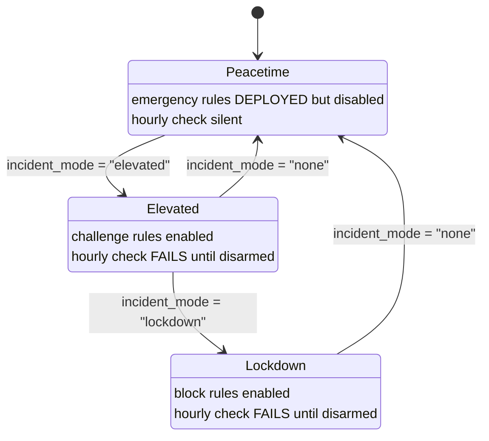

### The mechanism

During an incident you want to raise defences in seconds, not write new
Terraform under pressure at 3am. So the emergency rules are **already written,
already reviewed, already deployed — and disabled.** Arming is a one-variable
change: `incident_mode` flips `enabled` across every emergency rule at once.

The second half is the part people skip. Every team is good at arming. Nobody
is good at disarming. So an hourly job asks the **API** what is enabled — not
your tfvars, because tfvars describe intent and intent is exactly what is wrong
when someone armed something by hand.

If anything is still armed, the job **fails**. A failing scheduled workflow
emails the owner and shows red on the Actions tab, every hour, until somebody
disarms. The nagging is the feature.

**Success is silent.** You only hear from it when it matters.

### Generalising it

The shape covers far more than WAF rules: a maintenance page still being
served, a feature flag left forced, a firewall rule opened "just for the
migration", debug logging left at TRACE.

### What it prevents

Emergency measures that quietly become permanent.

---

## 7. Drift detection

**Files:** [`workflows/drift-detection.yml`](workflows/drift-detection.yml) ·
[`scripts/drift_report.py`](scripts/drift_report.py)

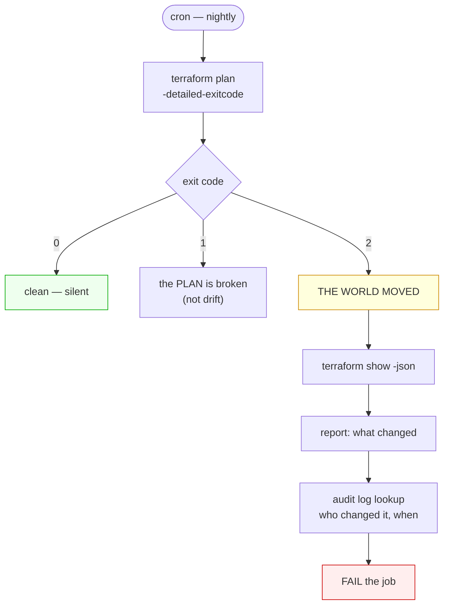

### The mechanism

`plan -detailed-exitcode` returns three distinct codes, and the third is the
one nobody uses: **0 clean, 1 error, 2 the world moved.** Exit 2 is the entire
trick, and it is what you put on a cron.

Why a schedule and not a PR check: drift does not happen when you push. It
happens at 2am during an outage, when someone with console access fixes
something by hand. A check that only runs when code changes will never see it.

Read `resource_drift` in the plan JSON, not `resource_changes` —
`resource_drift` is specifically what changed *outside* Terraform.

**Read-only on purpose.** Noticing that something is wrong should never require
the ability to change it.

**Fail, don't warn.** A drift job that goes green-with-a-warning is ignored
within two weeks.

### Attribution

Join the drift to your provider's audit log and name the actor. Make this step
`continue-on-error: true` — attribution failing must never suppress detection.
In our lab the audit lookup needs a permission the token lacks, so detection
works and naming does not; the report says so in one line rather than pretending.

### What it prevents

Code that quietly stops describing production, discovered during the next
incident.

---

## 8. Brownfield adoption

**Files:** [`scripts/normalize.py`](scripts/normalize.py) ·
[`examples/import-blocks.tf`](examples/import-blocks.tf)

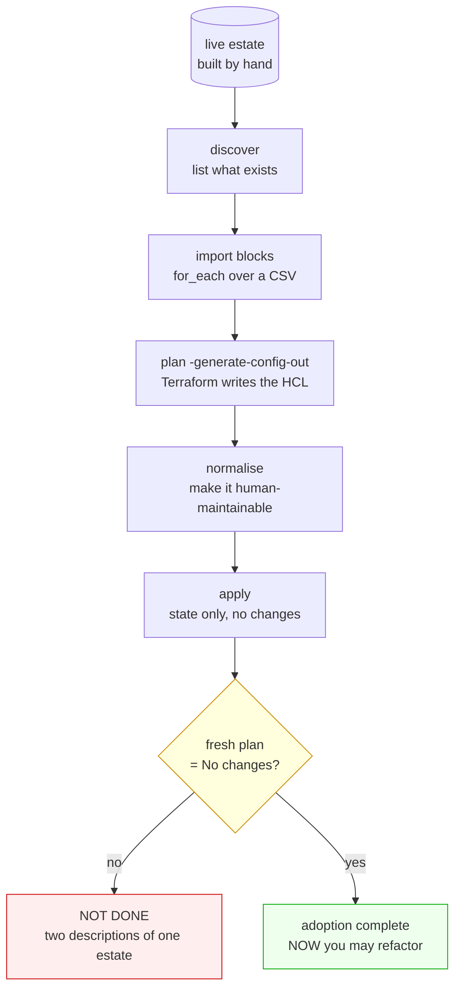

### The mechanism

Nobody starts greenfield. You inherit an estate someone built by hand and have
to bring it under Terraform without an outage, because these are live records.

**`import` blocks, not the `terraform import` command.** Import blocks are
declarative: they live in code, appear in the diff, get reviewed, and can be
`for_each`'d over a list. The old CLI command was a one-shot you ran by hand and
hoped.

**`-generate-config-out`** makes Terraform write the HCL for you. It is correct
and unreadable — machine-named resources, every attribute spelled out. Normalise
it into something a human will maintain, or nobody will.

**The gate is the step people skip.** Adoption is not finished when it applies.
It is finished when a *fresh plan says no changes*. Until then you have two
descriptions of one estate and no idea which is true. Make it a hard gate:

```bash
terraform plan -detailed-exitcode || { echo "NOT clean — do not refactor yet"; exit 1; }
```

### What it prevents

Half-adopted estates, and the refactor-on-top-of-uncertainty that follows.

---

## 9. Tunnel HA and rotation

**Files:** [`examples/tunnel-ha.tf`](examples/tunnel-ha.tf) ·
[`examples/docker-compose.tunnel.yml`](examples/docker-compose.tunnel.yml)

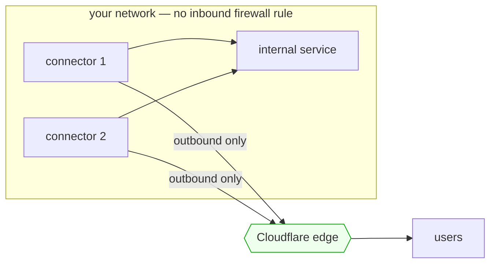

**Rotation without downtime:**

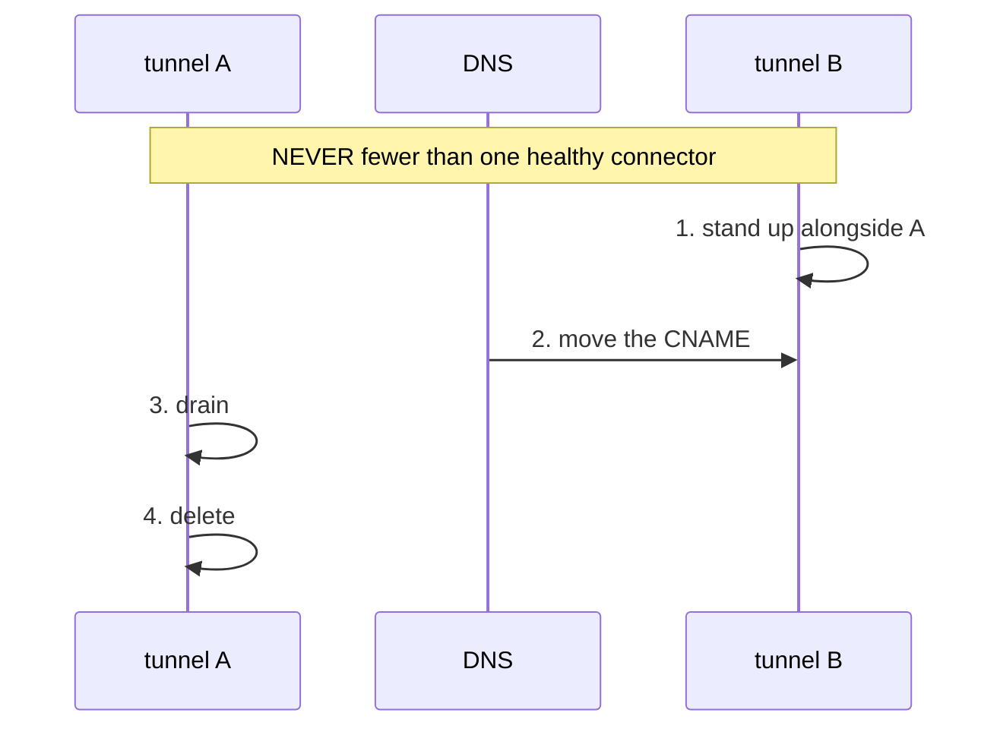

### The mechanism

A tunnel is an outbound-only connection from your network to the edge, so you
publish an internal service with no inbound firewall rule and no public IP.

**One tunnel, several connectors.** Run at least two replicas; the edge
load-balances across healthy ones. Kill one and traffic keeps flowing.

**Manage config remotely** (`config_src = "cloudflare"`) so a replica restart
cannot pick up a stale local file.

**The catch-all ingress rule must be last** — omit it and the tunnel refuses to
start. It is the `default:` of a switch statement.

**Rotate in two steps, never one.** Delete-then-create has a window with zero
healthy connectors. Stand the new one up first, move DNS, drain, then delete.

> **Unverified in our lab:** the token could read tunnels but not create them,
> so this pattern is documented from the module rather than demonstrated end to
> end. Test it in your own account before relying on it.

### What it prevents

A single connector as a single point of failure, and rotations that take the
service down.

---

## 10. The sharp edges

Four specific failures, each cheap to avoid once you have seen it.

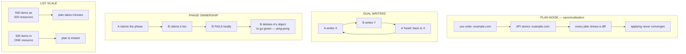

### Plan noise — the API rewrites what you asked for

You write a CNAME without a trailing dot; the API stores it with one. Now every
plan shows a diff, applying does not converge, and the pipeline is never green
again.

**Fix:** write the canonical form — what the API will actually store.

**Do NOT reach for `ignore_changes`.** It silences the diff by no longer
managing the field at all, so a genuine repoint of that CNAME also passes
unnoticed. You would trade a cosmetic itch for blindness on the field that
matters most.

### Dual writers — the silent one

Two roots manage the same record. B overwrites A; A's next run "heals" it back;
repeat forever, both pipelines green. Same root cause as singleton ownership,
different object. Detection is drift + audit log.

### Phase ownership — the loud one, which is better

Two roots claim the same ruleset phase. The second **fails loudly** — the slot
is taken and the API says so. That is the healthy outcome.

The pathological path is what happens next: B's team deletes A's object in the
console so their pipeline goes green, and A's next apply recreates it. Now you
have ping-pong plus a deletion nobody reviewed.

**Fix:** one root owns a phase; other teams contribute *fragments* to it
(pattern 5), never their own object.

### List scale — model the collection, not the items

500 entries as 500 resources means 500 API reads per plan. The same 500 as
*items inside one resource* is a single read. Model the collection as the unit
when the provider offers both.

> **Measured, not demonstrated:** our lab token lacked account-level list
> permissions. Benchmark this in your own account before designing around it.

---

## Adopting these — a suggested order

You do not need all ten, and doing them in the wrong order wastes effort.

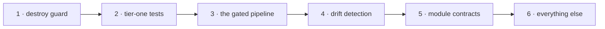

1. **Destroy guard first.** Highest value per line in the whole kit, and it
   works against any plan you already produce.
2. **Tier-one tests.** They make everything after this safe to change.
3. **The gated pipeline.** The big one. Do it once tests exist.
4. **Drift detection.** Now that code is trustworthy, find out where reality
   disagrees.
5. **Module contracts.** Refactor toward these as modules stabilise.
6. The rest as the problems actually show up. Adopting a pattern for a problem
   you do not have is how platform teams lose credibility.
