# CLICK BY CLICK - the exact operating guide

Every label, button and message below was read off the live UI on
2026-09-02, not remembered. Where it says a button is called
**Review deployments**, that is the exact string on the button.

This is the *operating* manual. The talk track lives in
[PRESENTER-GUIDE.md](PRESENTER-GUIDE.md); use that for what to say and this
for what to click.

**Screenshots are real and already in the repo.** They were captured from
this machine against the live account on 2026-09-02, cropped to a single
window so nothing else on the desktop appears. If a screen changes, re-capture
it with:

```bash
powershell -ExecutionPolicy Bypass -File scripts/capture-window.ps1   -TitleMatch "cf-terraform-lab" -Out "docs/img/03-actions-demo-workflow.png"
```

Add `-NoFocus` when a dropdown or modal is open (focusing the window would
dismiss it), and `-CropTop 0 -CropBottom 0` for terminal windows.

---

# PART 0 - SETUP (do this before sharing your screen)

## 0.1 Open the right terminal

**Every command in this guide is Git Bash. PowerShell will fail** with
`The term 'source' is not recognized as the name of a cmdlet` on the very
first line. That error means the shell is wrong, not the command.

**DO:** In VS Code press **Ctrl + Shift + `** to open a terminal. In the
terminal panel, click the **v** chevron next to the **+** icon, and choose
**Git Bash** from the dropdown.

**Or:** Start menu, type `Git Bash`, press Enter.

**Check you are in the right shell.** The prompt must look like this, ending
in `$` with forward slashes:

```
GRIGS@DESKTOP-3O7JSNO MINGW64 /d/Work/Claude/Shared Subnet Diagram/cf-terraform-lab (main)
$
```

If it looks like `PS D:\Work\...>` you are in PowerShell. Switch.


## 0.2 Load the environment

**DO:** paste this one line. Nothing else in the guide works until it has run.

```bash
source ~/.cf-lab-env && cd "D:/Work/Claude/Shared Subnet Diagram/cf-terraform-lab" && clear
```

It loads your Cloudflare tokens from `~/.cf-lab-env` (a file outside the repo,
never committed) and moves you to the repo root. **If you open a new terminal
later, run it again.**

**Common mistake:** running a demo from inside `scripts/`. Then
`bash scripts/demo-27-make-drift.sh` resolves to `scripts/scripts/...` and you
get `No such file or directory`. The line above puts you in the right place.

## 0.3 Make the font readable

**DO:** press **Ctrl** and **+** four or five times. Aim for text readable
from the back of the room.

## 0.4 Run the pre-flight

**DO:** paste the whole block. It is self-contained and safe in a fresh
terminal.

```bash
source ~/.cf-lab-env && cd "D:/Work/Claude/Shared Subnet Diagram/cf-terraform-lab"
terraform -chdir=infra/envs/lab plan -input=false 2>&1 | grep -E "No changes|^Plan:"
terraform -chdir=brownfield/adopt plan -input=false -var zone_id=6fe522935f35ff5b7e1a049c1a90d11e -var zone_name=$LAB_ZONE 2>&1 | grep -E "No changes|^Plan:"
curl -s -H "Authorization: Bearer $CLOUDFLARE_API_TOKEN" "https://api.cloudflare.com/client/v4/zones?name=$LAB_ZONE" | jq -r '.result[0].status'
terraform test 2>&1 | tail -1
```

**Exactly this must come back:**

```
No changes. Your infrastructure matches the configuration.
No changes. Your infrastructure matches the configuration.
active
Success! 5 passed, 0 failed.
```

| If you see | It means | Do this |
|---|---|---|
| `Plan: 0 to add, 1 to change` | a previous run was interrupted | run the RESET block in Part 4 |
| `command not found` | wrong shell, or a terminal older than the tool install | open a fresh Git Bash |
| `unbound variable` / 401 | you skipped 0.2 | run the `source` line |

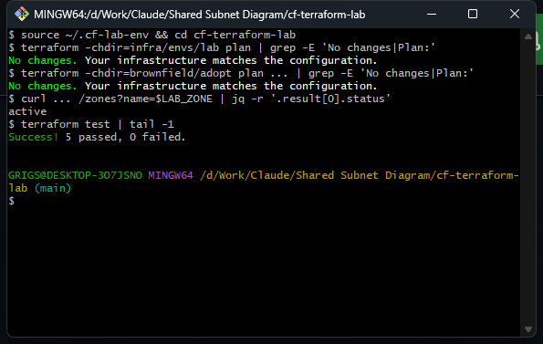

## 0.5 Open three Chrome tabs, left to right

| Tab | URL | Used for |
|---|---|---|
| **1** | https://github.com/miroslavt-arch/cf-terraform-lab | the code |
| **2** | https://github.com/miroslavt-arch/cf-terraform-lab/actions/workflows/demo.yml | running topics |
| **3** | https://dash.cloudflare.com/f40b69d8637a12568c6a62d218822384/zesty-beta.sxplab.com/dns/records | the result |

**Un-minimise the Chrome window fully.** A minimised window screenshares as a
blank rectangle.

---

# PART 1 - RUN A TOPIC FROM THE GITHUB CONSOLE

This is the recommended route when presenting. Twelve topics, same six steps
every time.

## Step 1 - open the workflow

**DO:** go to **Tab 2**.

**You will see:** a left sidebar listing `contract-tests`, `demo (run a topic)`,
`drift`, `killswitch-reminder`, `tf-apply`, `tf-pr`. The heading reads
**demo (run a topic)** with `demo.yml` beneath it in blue.

Below the heading is a blue banner:
`This workflow has a workflow_dispatch event trigger.` and at its right end a
grey button labelled **Run workflow** with a **▾** chevron.

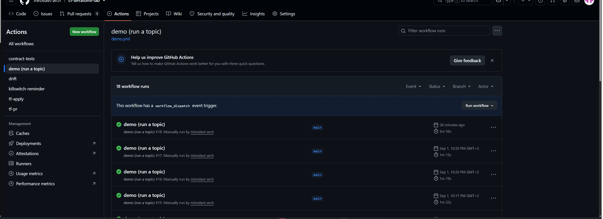

## Step 2 - open the dispatch form

**DO:** click **Run workflow ▾** (top right of that blue banner).

**A panel drops down containing, top to bottom:**

1. `Use workflow from` with a branch selector reading **Branch: main**
2. A label **Which topic to demonstrate** above a dropdown, pre-filled with
   `topic-27-drift-detection`
3. A green **Run workflow** button at the bottom of the panel

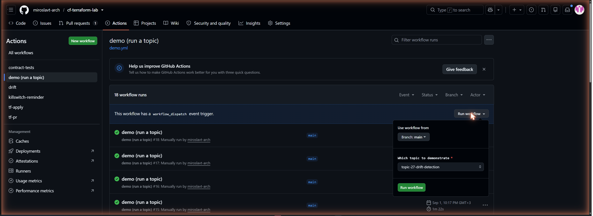

## Step 3 - choose the topic

**DO:** click the dropdown under **Which topic to demonstrate** and pick one:

```
topic-07-module-design
topic-09-singleton-ownership
topic-10-waf-composition
topic-11-kill-switch
topic-14-tunnel-design-walkthrough
topic-20-stale-plan-invariant
topic-24-terraform-test
topic-27-drift-detection
topic-29-brownfield-adoption
topic-32-plan-noise
topic-32-dual-writers
topic-32-phase-ownership
```

**DO:** click the green **Run workflow** button.

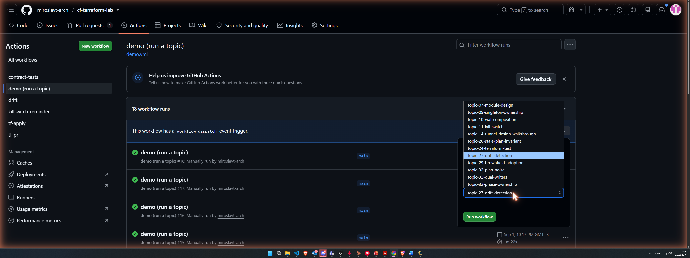

## Step 4 - the run appears and stops at the gate

**DO:** press **F5**. A new row appears at the top of the run list with a
yellow dot. Click it.

**On the run page you will see, verbatim:**

- Status: **Waiting**
- A banner: **miroslavt-arch requested your review to deploy to lab-apply**
- A button: **Review deployments**
- In the job list: **lab-apply waiting for review**
- Lower down, a heading **Deployment protection rules** with the subtitle
  *Reviewers, timers, and other rules protecting deployments in this run*
- A row reading **Wait timer** / *waiting* / **lab-apply 1 minute wait timer**

**Nothing is running.** No checkout, no Terraform, no credential. This is the
whole point of the topic, so let the room look at it.

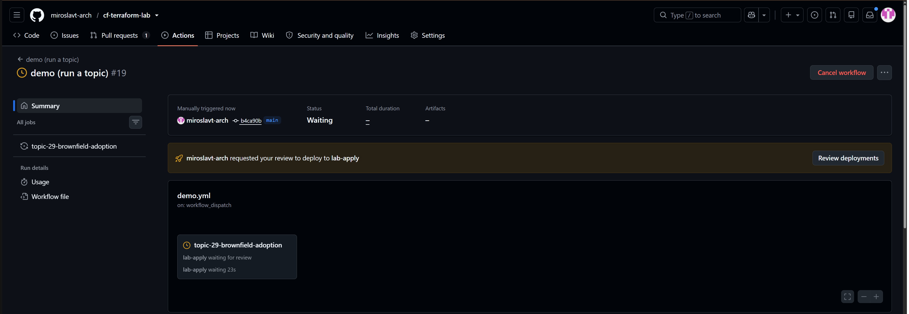

## Step 5 - approve

**DO:** click **Review deployments**.

**A modal opens containing:**
- A checkbox labelled **lab-apply**
- A textbox labelled **Leave a comment:**
- A **Reject** button and a green **Approve and deploy** button

**DO:** tick the **lab-apply** checkbox, then click **Approve and deploy**.

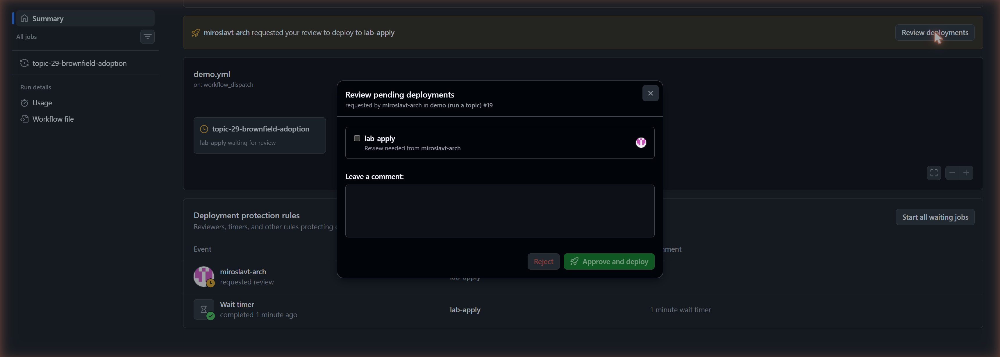

**The protection-rules table** lower down the same page shows both rules and
their state - who was asked, and whether the timer has elapsed:

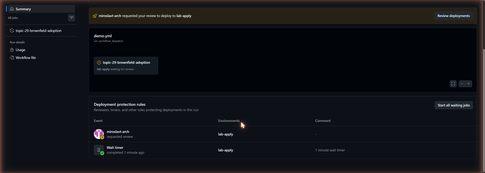

> **If the timer has not finished**, the page keeps showing
> **Review deployments** plus a **Start all waiting jobs** button. The wait
> timer and the reviewer are two separate rules; both must pass. **Start all
> waiting jobs** skips the timer. During a demo, just wait the minute out -
> the pause is the lesson.

## Step 6 - watch it run, then show the result

**DO:** click the job name in the left panel to expand the live log.

**DO:** when it finishes, scroll to the top of the run page for the **Summary**
section. The output is rendered there in a code block, followed by two links
into the Cloudflare dashboard.

**After approval** the banner reads *The deployments have been approved.* and
the status flips to **In progress**, with the job showing *Deploying to
lab-apply*:

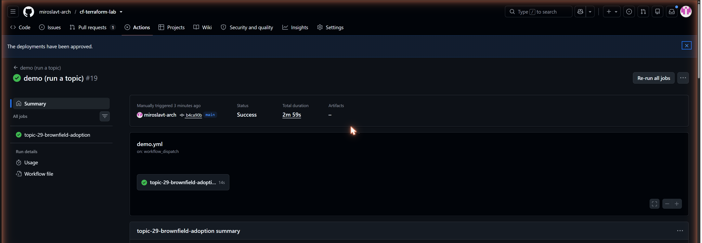

**When it finishes**, the Summary section renders the demo's output:

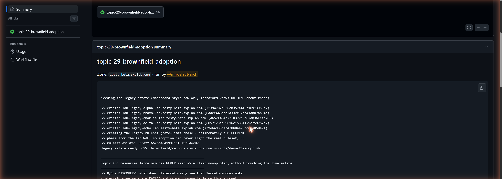

**DO:** switch to **Tab 3** and press **F5** to show the effect on Cloudflare.

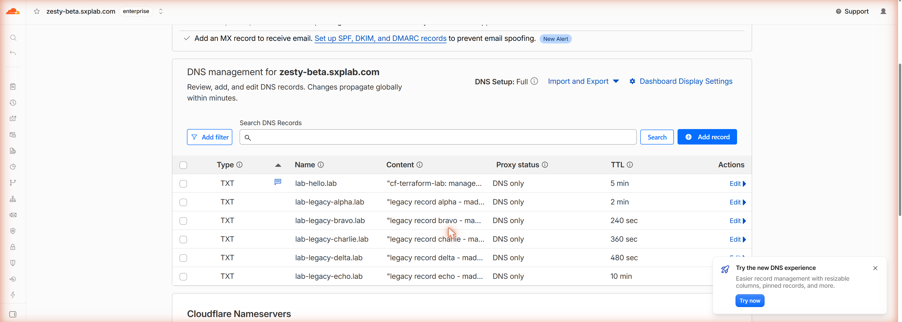

---

# PART 2 - THE FULL PIPELINE (Topic 20)

This is different from Part 1. Here you show the *real* change pipeline:
a pull request produces a plan, a human approves it, and that exact plan is
applied.

## 2.1 Show the plan CI wrote

**DO:** open the pull request:
https://github.com/miroslavt-arch/cf-terraform-lab/pull/1

**DO:** scroll the *Conversation* tab to the comment headed
**Terraform plan for `2277b17d`**. Click the grey triangle labelled
**plan output** to expand it.

**Point at the line:** `Artifact: tfplan-2277b17df45af...` - the artifact is
named after the commit SHA.

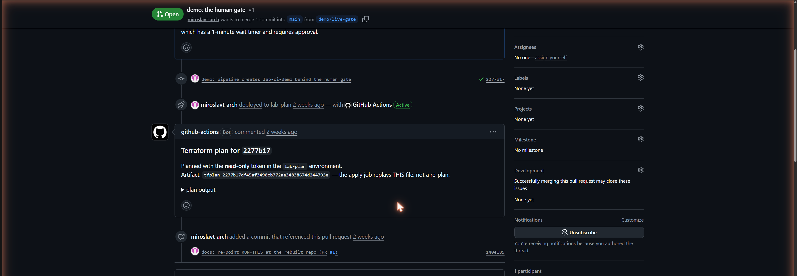

## 2.2 Show that the planning job cannot write

**DO:** open
https://github.com/miroslavt-arch/cf-terraform-lab/settings/environments
and click **lab-plan**.

**You will see** an **Environment secrets** section listing exactly two:
`CLOUDFLARE_API_TOKEN_PLAN` and `CLOUDFLARE_AUDIT_TOKEN`. No protection rules.

## 2.3 Show the gate

**DO:** click **Environments** in the breadcrumb, then **lab-apply**.

**You will see:**
- **Required reviewers** with your name
- **Wait timer** set to **1** minute
- **Environment secrets**: `CLOUDFLARE_API_TOKEN` and `CLOUDFLARE_AUDIT_TOKEN`

The write token and the protection rules are in the same box. GitHub injects
environment secrets only after the rules pass, so approval is what hands the
job its credential.

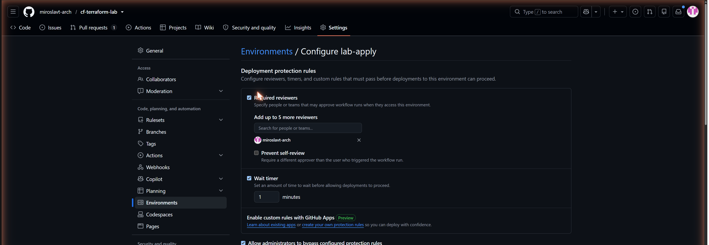

## 2.4 Fire the apply

**DO:** in **Git Bash**, paste as one line:

```bash
gh workflow run tf-apply.yml --repo miroslavt-arch/cf-terraform-lab -f plan_run_id=32469271562 -f sha=2277b17df45af3490cb772aa34838674d244793e
```

**DO:** go to Tab 2, **F5**, open the top `tf-apply` run. It sits at
**Waiting**, exactly as in Part 1 Step 4. Approve it the same way.

**DO:** expand the step **download the EXACT plan artifact**, then
**apply the pinned plan - NOT a fresh plan**.


## 2.5 Show the invariant underneath

**DO:** in **Git Bash**:

```bash
bash scripts/demo-20-stale-plan.sh
```

**You will see, verbatim:**

```
Error: Saved plan is stale

The given plan file can no longer be applied because the state was changed
by another operation after the plan was created.
```

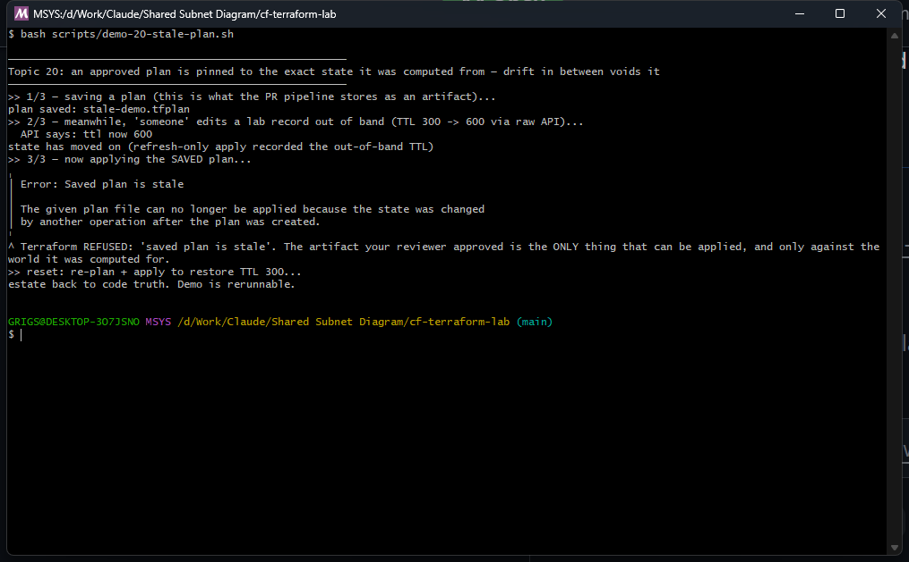

---

# PART 3 - RUN A TOPIC FROM GIT BASH

Faster, no approval click, but the room watches a terminal. One line each.

| Topic | Command |
|---|---|
| 7 | `bash scripts/demo-07-validation.sh` |
| 7 | `git diff v0.1.0 v0.2.0 -- infra/modules/zone-baseline/variables.tf` |
| 9 | `bash scripts/demo-09-singleton-flap.sh` |
| 10 | `bash scripts/demo-10-fragment-lint.sh` |
| 11 | `bash scripts/demo-11-arm.sh` |
| 14 | `bash scripts/ci-demo-14-walkthrough.sh` |
| 20 | `bash scripts/demo-20-stale-plan.sh` |
| 24 | `bash scripts/demo-24-unit-tests.sh` |
| 27 | `bash scripts/demo-27-make-drift.sh` |
| 29 | `bash brownfield/seed-legacy.sh` then `bash scripts/demo-29-adopt.sh` |
| 32 | `bash scripts/demo-32-noise.sh` |
| 32 | `bash scripts/demo-32-dual.sh` |
| 32 | `bash scripts/demo-32-phase.sh` |

## What each one prints (real, captured)

**Topic 24** - the headline is the timing:
```
  run "settings_composition"... pass
  run "default_propagation"... pass
  run "invalid_record_type_rejected"... pass
  run "fragment_ordering"... pass
  run "killswitch_arming"... pass
Success! 5 passed, 0 failed.

real    0m0.4s
```

**Topic 7** - the module's own error, fired at plan:
```
Error: Invalid value for variable
Every DNS record key must start with 'lab-'. This module refuses to create
records that are not trivially identifiable as lab-owned.
```

**Topic 10** - two policy failures, each explaining itself:
```
12 tests, 12 passed, 0 warnings, 0 failures, 0 exceptions
FAIL - app-team fragment: rule 'lab_app_sneaky_skip' uses action 'skip'.
FAIL - app-team fragment: rule 'lab_app_admin_grab' matches an /admin path.
```

**Topic 9** - the flap, with no errors anywhere:
```
current security_level: high
root A applied. dashboard value now: high
root B applied. dashboard value now: essentially_off
value now: high   <- and back again. Forever.
```

**Topic 11** - the stopwatch:
```
armed incident rules BEFORE: []
ARMED at the edge in 6 seconds. armed rules: [lab_ir_elevated_challenge]
DISARMED in 7 seconds. armed rules: []
```

**Topic 29** - read the counters aloud:
```
Plan: 5 to import, 0 to add, 0 to change, 0 to destroy.
normalized generated_ruleset.tf: removed 84 noise lines
Apply complete! Resources: 6 imported, 0 added, 0 changed, 0 destroyed.
No changes. Your infrastructure matches the configuration.
```

**Topic 27** - one flag is the whole detector:
```
  drifted: ttl -> 900
exit code 2 - drift detected, exactly as the nightly workflow would see it
**1 resource(s) drifted from code truth:**
- module.zone_baseline.cloudflare_dns_record.this["lab/lab-hello"]  actions: update
drift healed.
```

**Topic 32 plan noise** - it never converges:
```
applied. API actually stored: example.com
      ~ content     = "example.com" -> "example.com."
Plan: 0 to add, 1 to change, 0 to destroy.
    after apply #1: Plan: 0 to add, 1 to change, 0 to destroy.
    after apply #2: Plan: 0 to add, 1 to change, 0 to destroy.
plan is QUIET. Code truth now equals API truth, byte for byte.
```

**Topic 32 dual writers**:
```
Root A creates lab-dual   -> live content: "owned-by-A"
Root B imports + applies  -> live content: "owned-by-B"
A's auto-apply            -> live content: "owned-by-A"
```

**Topic 32 phase ownership**:
```
A owns the phase. A's pipeline is green.
Root B claims the SAME phase...
    Error: failed to make http request
^ B FAILS. The phase slot is taken, and this loud error is the HEALTHY outcome.
```

---

# PART 4 - THE CODE TO SHOW

When someone asks "where does that live", these are the exact files.

| Topic | File | What to point at |
|---|---|---|
| safety | `policy/destroy_guard.rego` | reads plan JSON, fails any delete without a `lab-` marker |
| 7 | `infra/modules/zone-baseline/variables.tf` | one `map(object)` input, four `validation` blocks |
| 7 | `infra/envs/lab/main.tf` line 25 | `source = "git::https://...?ref=v0.1.0"` - a tag, not a path |
| 9 | `infra/modules/zone-baseline/main.tf` | `settings_baseline` locals map, `for_each` over the merge |
| 10 | `infra/modules/waf-composed/main.tf` | `ordered_rules = concat(...)` - the only ordering authority |
| 10 | `.github/CODEOWNERS` | per-fragment routing |
| 11 | `infra/modules/waf-composed/rules/incident.yaml` | rules carrying `min_mode` |
| 11 | `.github/workflows/killswitch-reminder.yml` | hourly, checks the live API not the repo |
| 14 | `infra/modules/tunnel-site/main.tf` | `config_src`, ingress with catch-all last |
| 20 | `.github/workflows/tf-pr.yml` | plan, artifact keyed by SHA, OPA guard |
| 20 | `.github/workflows/tf-apply.yml` | downloads that artifact, applies it |
| 24 | `tests/unit.tftest.hcl` | `mock_provider`, five `run` blocks |
| 27 | `.github/workflows/drift.yml` | nightly cron, per-environment matrix |
| 27 | `scripts/drift_report.py` | plan JSON joined to the audit log |
| 29 | `brownfield/adopt/main.tf` | one `import` block with `for_each` over a CSV |
| 32 | `demos/sharp-edges/*/README.md` | one per failure, each with its fix |

---

# RESET, between runs

**DO:** in Git Bash:

```bash
source ~/.cf-lab-env && cd "D:/Work/Claude/Shared Subnet Diagram/cf-terraform-lab"
terraform -chdir=infra/envs/lab apply -auto-approve -input=false >/dev/null
terraform -chdir=infra/envs/lab plan -input=false | grep -E "No changes|^Plan:"
```

Expect `No changes`. Every demo already resets itself as its last act; this
only matters if you interrupted one mid-run.

---

# RE-CAPTURING A SCREENSHOT

`scripts/capture-window.ps1` captures ONE window, never the whole desktop, so
your mail and chat windows cannot leak into a client-facing guide. It crops
150px off the top by default, which removes Chrome's tab strip (that strip
shows every other tab you have open) and any debug banner.

| Situation | Flags |
|---|---|
| A normal Chrome page | `-TitleMatch "cf-terraform-lab"` |
| A dropdown or modal is open | add `-NoFocus` (focusing would close it) |
| A Git Bash window | `-TitleMatch "MSYS" -CropTop 0 -CropBottom 0` |

The terminal shots were produced by launching a dedicated Git Bash window
running one demo, so the screenshot shows only that demo:

```bash
mintty -s 140,42 /usr/bin/bash -l ~/shot-stale.sh
```
